# Initial iDrac configuration on Dell PowerEdge R620/R730 servers.
**Please use this as a guide when you setup a Dell PowerEdge server and mount that into a rack initially. Default, when you connect the network cables, iDrac will issue a self assigned ip : 192.168.0.120. We can chnage this to the required IP assuming that the IP space available and the network / switches are configured properly.**

> * iDRAC (Integrated Dell Remote Access Card) configuration utility is accessed at boot time, and is useful when installing a new PowerEdge server. 
> * iDRAC alerts you when an issue occurs, enables streamlined local and remote server management, and reduces or eliminates the need for administrators to physically visit the server.

```diff
- Initial Setup:
+ This assumes that the personnel should have physical access to the server in the data center. 
+ You should also have access to a monitor and keyboard. Another assumption is that the server 
+ is rack mounted and all the power cables as well as network cables are connected properly.
``` 

1.	Connect the Monitor and Keyboard using the respective ports on the front panel of the server (At least for the PowerEdge R620 and PowerEdge R730xd).

2.	Power on the server by pressing the power button on the front side panel of the server. You should see the light if power cables are connected properly.

3.	When on the Bios Screen, Press <F2> to enter System Setup Main Menu.

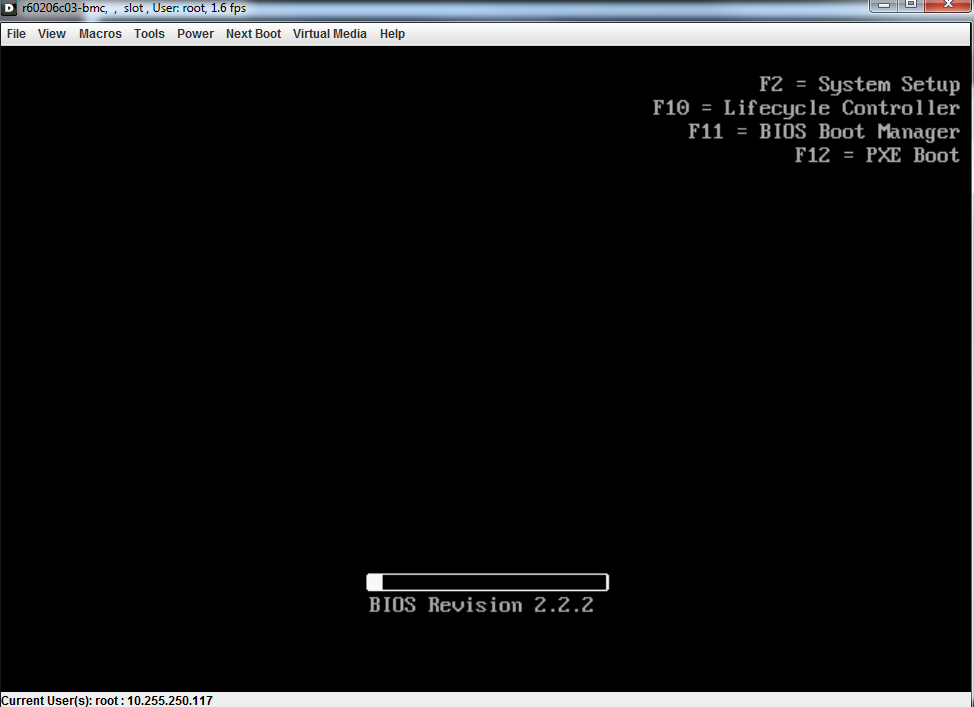

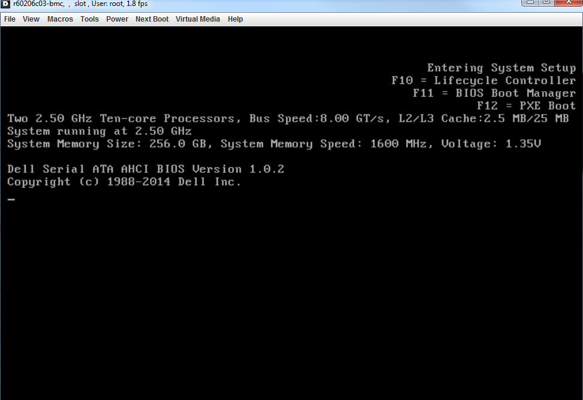

4.	Select iDRAC Settings from the System Setup Main Menu (F2 > iDRAC Settings).

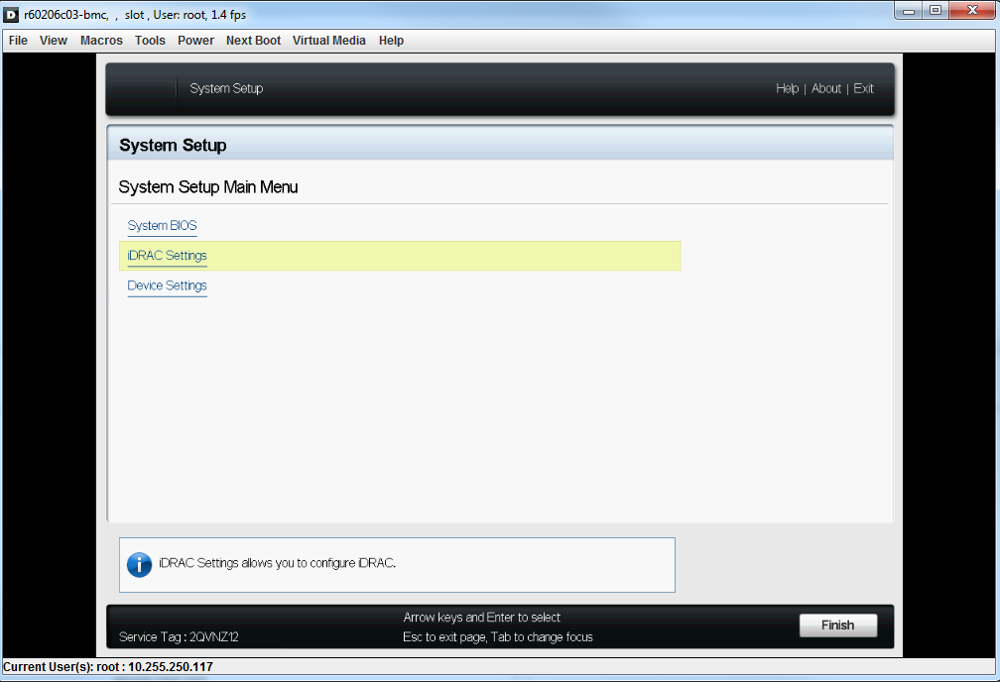

5.	Use the arrow keys / mouse to select “Network”.

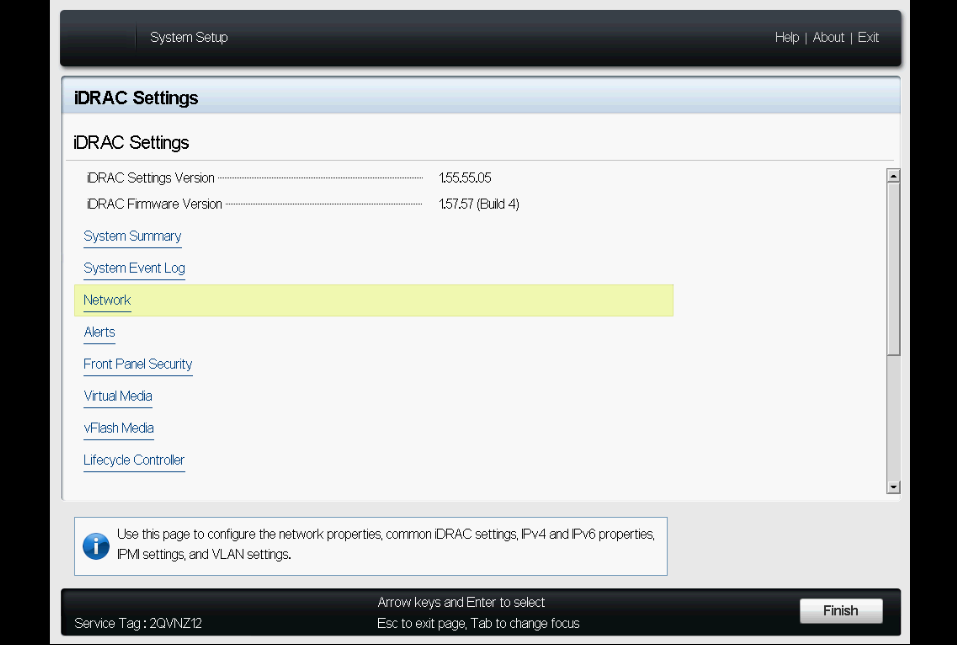

6.	Configure the “Static IP address” under IPV4 SETTINGS section. (Use either arrow keys / mouse to navigate). [We can also configure the other parameters as well from this page, but we are going to use the automated script for it.]

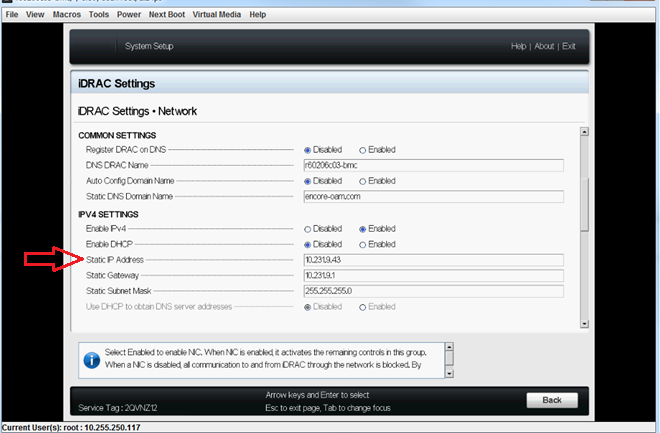

7.	After you make the changes to the iDRAC configuration, press the <ESC> key to display the Exit menu. [At this point you will see “iDRAC Settings” page as shown in Step 4.]

8.	Press again <ESC> key / or Click on “Finish” button to save the settings that we have changed in previous steps. Click on “Yes” to apply and save the settings.

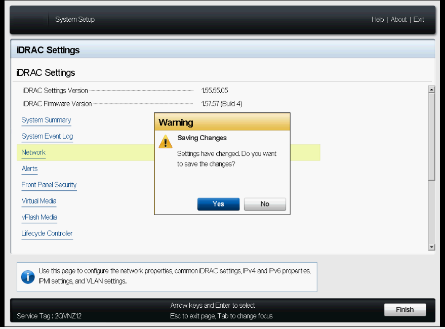

9.	When the changes are successfully saved, we will get a prompt as shown below. Click “OK” will exit the “iDRAC settings” menu page and we will be back at the “System Setup” menu page as shown in Step 9.

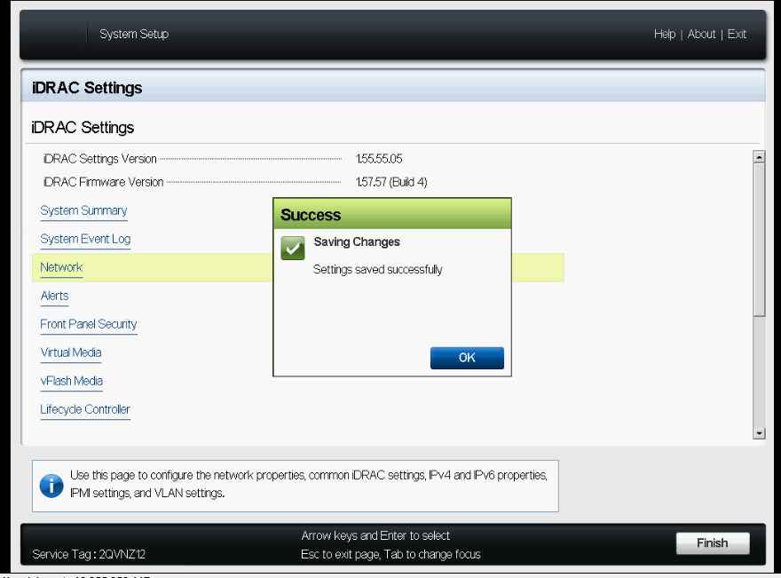

10.	Use the arrow keys / mouse to select “System BIOS” on System Setup menu Page.

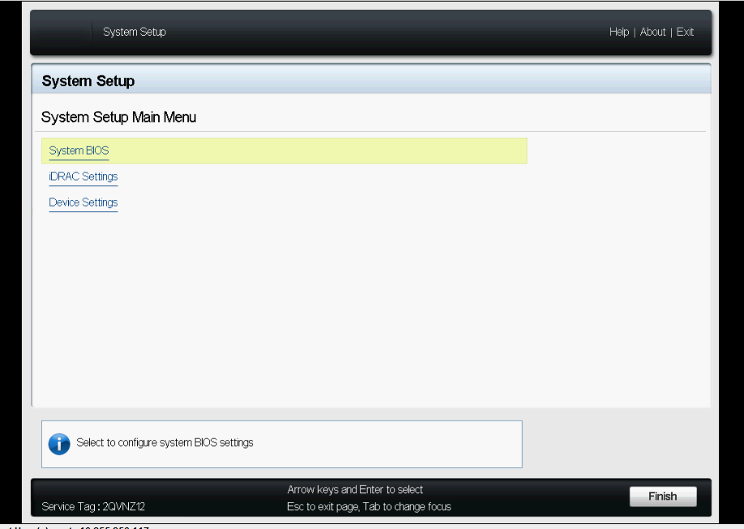

11.	 On “System BIOS Settings” menu page, click on “Default” button to load the default settings for all System BIOS settings. 

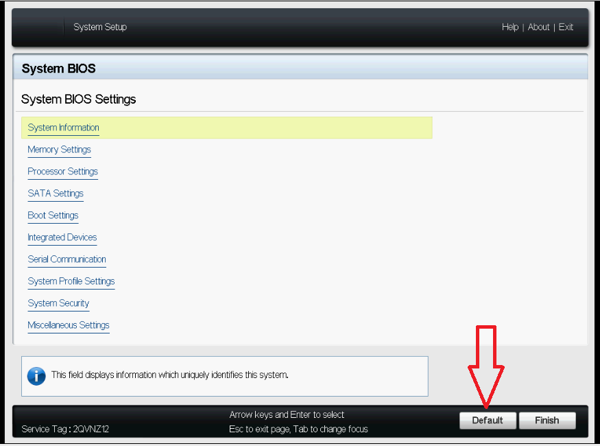

12.	We will be prompted with a Warning Dialog to load default settings, on that dialog click “Yes”.

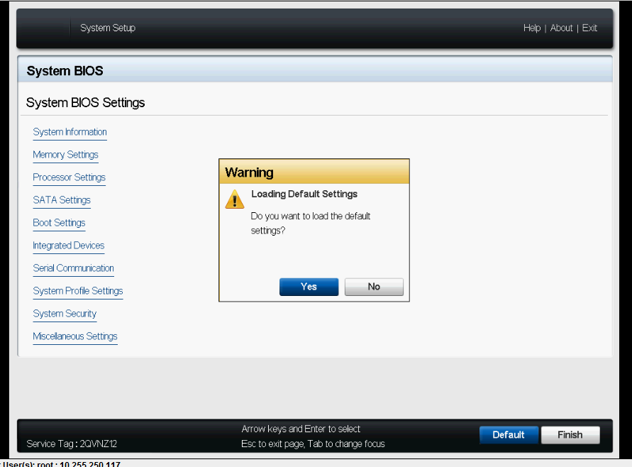

13.	When finished loading the Default settings, A “Success dialog” will be prompted as shown below. Click “OK” to close the 
dialog. [At this point we will be on the “System BIOS settings” menu page]

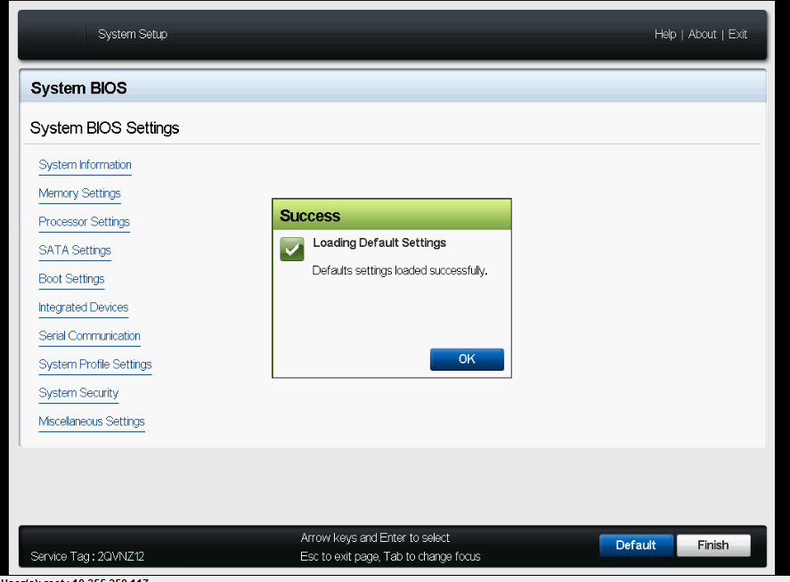

14.	Now, press <ESC> key or Click on “Finish” button will prompt a “Warning dialog” which says that the settings have changed and needs to be changed. Click “Yes” on it to save the changes.

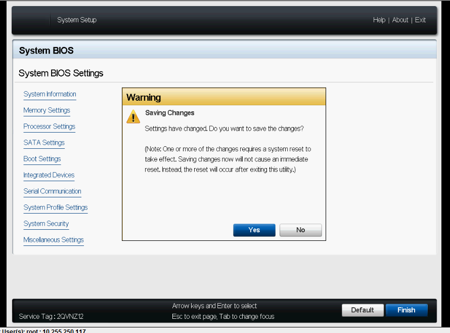

15.	When the changed are saved successfully, we will get “Success Dialog” as shown below. Click “OK” on it will close the dialog and we will be back to the “System Setup Main Menu” as shown Step 3. 

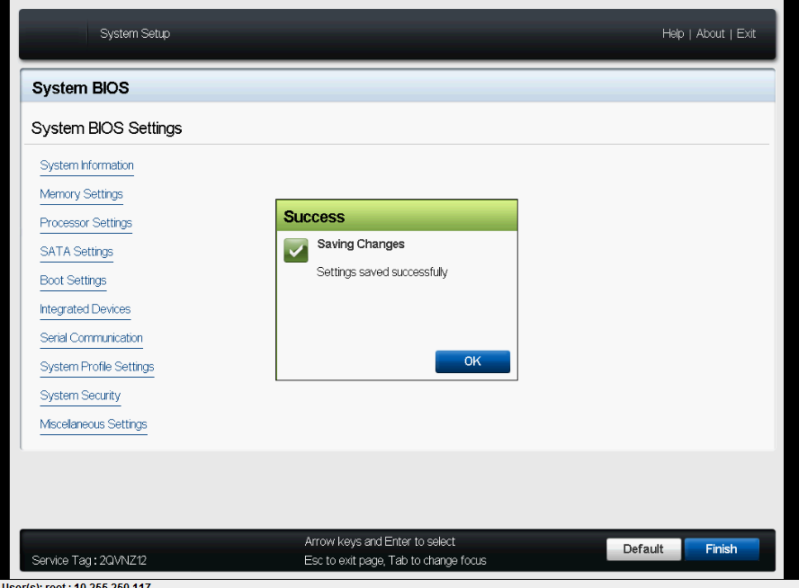

16.	Again, press <ESC> key or Click on “Finish” button on “System Setup Main Menu” will prompt a “Warning dialog” which says Exit and Reboot the system as shown below. 

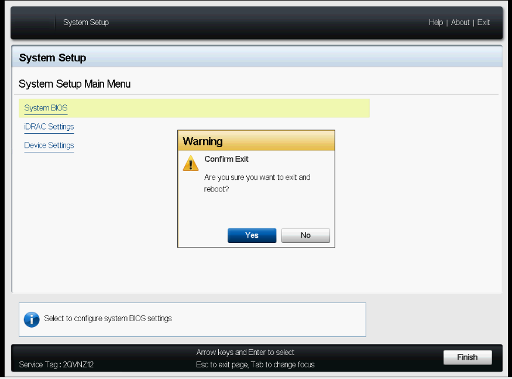

17.	During the reboot process, the system will apply and reconfigure all the settings that we changed. Once the system is UP after the Reboot, we will be able to access the iDRAC through web interface remotely. 

**Open any web browser, then type:**

* https://[iDRACIP]/  (or)
* https://[fqdn of the iDrac] 

The default username is : `root` and the default password is : `calvin`.
